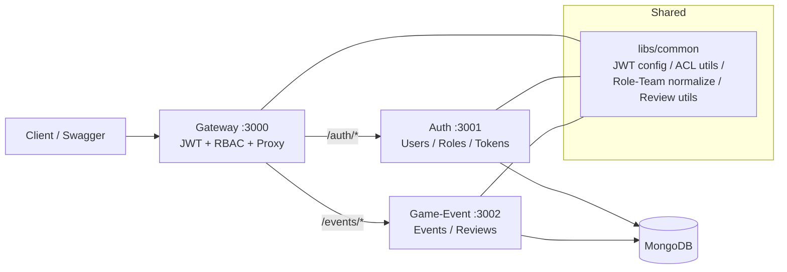

# Team Review Platform (TRP)

[](https://nodejs.org/)
[](https://www.mongodb.com/)
[](https://www.docker.com/)
[](https://eslint.org/)

**MSA 기반 게임 이벤트 리뷰 관리 플랫폼**

NestJS와 MongoDB를 활용한 마이크로서비스 아키텍처 기반의 엔터프라이즈급 이벤트 리뷰 시스템입니다.   
Gateway 중심의 MSA(3 Services: Gateway / Auth / Game-Event) 구조로 구성되어 있으며,     
JWT 기반 인증과 RBAC 권한 제어, 리뷰 상태 머신, 동시성 제어 기반 리뷰 워크플로우를 제공합니다.

---

## 📑 목차
- [프로젝트 소개](#-프로젝트-소개)
- [주요 기능](#-주요-기능)
- [핵심 기술적 포인트](#-핵심-기술적-포인트)
- [아키텍처](#-아키텍처)
- [기술 스택](#-기술-스택)
- [시작하기](#-시작하기)
- [주요 API](#-주요-api)
- [핵심 구현 상세](#-핵심-구현-상세)
- [보안](#-보안)
- [Gateway 보호](#-gateway-보호)
- [코딩 컨벤션](#-코딩-컨벤션)
- [기술적 의사결정](#-기술적-의사결정)
- [향후 개선](#️-향후-개선)

---

## 📚 프로젝트 소개

**Team Review Platform(TRP)** 은 게임 이벤트를 생성/관리하고, 여러 팀(예: DEV/QA/CS/PM)이 참여하는 리뷰 프로세스를 **상태 머신으로 일관되게 운영**하기 위한 백엔드 플랫폼입니다.

특히 다음 상황을 안정적으로 처리하는 것을 목표로 합니다.

- 여러 리뷰어가 **동시에 같은 이벤트의 리뷰 상태를 변경**하는 경우
- 리뷰어 재지정(추가/삭제/변경) 시 **상태·완료시각·최종 승인 상태의 일관성** 유지
- 민감 이벤트(`isConfidential`)의 접근 범위를 역할/관계 기반으로 제한

---

## ✨ 주요 기능

### 마이크로서비스 아키텍처
- **Gateway Server**: 단일 진입점, JWT 인증, RBAC 권한 검사, 요청 프록시
- **Auth Server**: 사용자 관리, 역할/팀 관리, JWT 발급/갱신
- **Game-Event Server**: 이벤트 CRUD, 리뷰 상태머신, 히스토리 관리

### 역할 기반 접근 제어 (RBAC)
- 4가지 역할: `ADMIN`, `PLANNER`, `REVIEWER`, `VIEWER`
- 팀 기반 리뷰 워크플로우: `PM`, `DEV`, `QA`, `CS`
- 세밀한 권한 제어 및 민감 정보 보호

### 리뷰 상태 머신
- 상태: `NOT_REQUIRED`, `PENDING`, `APPROVED`, `REJECTED`
- 자동 최종 상태 계산 (모든 팀 승인 시 자동 승인)
- 완전한 리뷰 히스토리 추적

### 동시성 제어
- 낙관적 잠금(Optimistic Locking)을 통한 동시 업데이트 충돌 방지
- MongoDB versionKey 기반 원자적 연산


---

## 🎯 핵심 기술적 포인트

### 1) MSA 설계 및 서비스 분리

**Gateway 중심 아키텍처**
```
외부 요청 → Gateway (인증/인가) → 내부 서비스 (x-user-* 헤더 전달)
```

- 모든 인증/인가 로직을 Gateway에 중앙화하여 공격 표면 최소화
- 내부 서비스는 도메인 로직에 집중
- `x-user-id`, `x-user-role`, `x-user-team` 헤더를 통한 컨텍스트 전달로 이중 검증 방지

**서비스 책임 분리**
- Auth: 사용자 계정, 역할, 토큰 관리 (플랫폼팀 관심사)
- Game-Event: 비즈니스 도메인 로직 (서비스팀 관심사)
- 독립적 배포 및 확장 가능

### 2) 리뷰 상태 머신 (State Machine)
- **상태:** `NOT_REQUIRED` / `PENDING` / `APPROVED` / `REJECTED`
- **전이 규칙:**  
  - 기본 전이: `PENDING → APPROVED | REJECTED`
  - `NOT_REQUIRED` 변경 금지(정책에 따라 제한)
  - 확정 상태 토글 등 특수 케이스는 ADMIN만 허용

### 3) 최종 상태 자동 계산 (finalStatus)
리뷰 팀 상태가 변경될 때마다 최종 상태를 일관되게 재계산합니다.

- 하나라도 `REJECTED` → `finalStatus = REJECTED`
- 하나라도 `PENDING` → `finalStatus = IN_PROGRESS`
- 모든 필요한 팀이 `APPROVED` → `finalStatus = APPROVED`
- 필요한 팀이 모두 `NOT_REQUIRED` → `finalStatus = APPROVED` (요구사항 의도에 맞춘 처리)

### 4) 동시성 제어: Optimistic Locking + Atomic Update
MongoDB `versionKey(v)` 기반의 낙관적 락을 적용했습니다.

- 업데이트 시 `_id + 현재 상태 + v` 를 조건으로 `findOneAndUpdate` 수행
- `$set`(상태/완료시각/finalStatus/approvedAt) + `$push`(history)를 **한 번의 원자 연산**으로 반영
- 충돌 시 **409 Conflict** 반환 → 클라이언트 재시도 가능

예)
```bash
PATCH /events/:id
Body: { "title": "Updated", "v": 3 }

# 다른 사용자가 먼저 수정하면 -> 409 Conflict
```

### 5) 리뷰어 재지정 시 상태/시간/최종 승인 일관성
리뷰어 변경은 “단순 교체”가 아니라 **상태 머신·완료시각·최종 상태**에 모두 영향을 주므로,
재지정 시 아래 규칙으로 재계산합니다.

- 새로 지정된 팀 → `PENDING`
- 삭제된 팀 → `NOT_REQUIRED`
- 그대로인 팀 → 상태 유지
- `PENDING` 또는 `NOT_REQUIRED`로 바뀐 팀은 `reviewedAt = null` 로 초기화
- 최종 승인 조건 충족 시 `approvedAt` 갱신

### 6) 스키마 설계: ReviewHistory 임베딩
`ReviewHistory`를 별도 컬렉션으로 분리하지 않고 `GameEvent` 스키마 내부에 내장하여,
- 이벤트 단위로 변경 이력을 함께 조회 가능
- 도메인 응집도 강화
- 단일 문서 업데이트로 감사 추적을 보장

### 7) 역할/팀 규칙 정규화

**자동 정규화 로직**
```typescript
// libs/common/utils/role-team.util.ts
normalizeRoleTeamOrThrow(role, team):
  - ADMIN/VIEWER → team = null (강제)
  - PLANNER → team = "PM" (강제)
  - REVIEWER → team ∈ {PM, DEV, QA, CS} (필수)
```

**이중 검증**
- 애플리케이션 레벨: `normalizeRoleTeamOrThrow` 유틸
- 데이터베이스 레벨: Mongoose Schema Validator

### 8) 세밀한 접근 제어

**역할별 조회 권한**
```typescript
// libs/common/utils/event-acl.util.ts
canReadEvent(user, event):
  - ADMIN: 전체 접근
  - PLANNER: 본인 생성 + 공개 이벤트
  - REVIEWER: 배정된 이벤트 + 공개 이벤트
  - VIEWER: 공개 이벤트만 (isConfidential=false)
```

**민감 정보 보호**
- `isConfidential` 플래그 기반 접근 제어
- 담당자, 지정 리뷰어, ADMIN만 접근 가능

| Role | 가능한 API 범위 | Team |
|---|---|---|
| ADMIN | 전체 접근 | - |
| PLANNER | 본인 생성 이벤트 CRUD | PM |
| REVIEWER | 배정된 리뷰만 수정 | PM/DEV/QA/CS |
| VIEWER | 비민감 정보 조회 | - |

---

## 🏗 아키텍처



### 인증 흐름 (Gateway 중심)
- Gateway에서 JWT 검증 후 내부 서비스로 `x-user-*` 헤더 전달
- 내부 서비스는 기본적으로 헤더 기반으로 요청 주체를 신뢰(내부 호출 최적화)
- **Swagger 직접 호출** 등의 편의를 위해 Bearer 토큰 검증을 fallback으로 제공(서비스 단독 호출 가능)


---


## 🛠 기술 스택

| 분야 | 상세 |
|---|---|
| **Framework** | NestJS |
| **Language** | TypeScript |
| **Runtime** | Node.js 20 (LTS) |
| **Database** | MongoDB (Mongoose) |
| **Auth** | JWT (Access/Refresh), bcrypt |
| **Authorization** | RBAC |
| **Infra/Run** | Docker, Docker Compose |
| **Code Style** | Airbnb Style Guide + ESLint + Prettier |

---

## 🚀 시작하기

### 1) Clone
```bash
git clone https://github.com/yooseungmo/team-review-platform.git
cd team-review-platform
```

### 2) 환경 변수(.env)
- 실행 편의를 위해 `.env`를 포함했으며, 민감 정보는 포함되어 있지 않습니다.
- 다만 공개 운영 기준으로는 **`.env`를 레포에 포함하지 않는 것을 권장**합니다.
- 운영 전환 시 `.env` 제거 후 Secret Manager(또는 Vault 등)로 이관하세요.

### 3) Docker Compose 실행
```bash
docker compose up --build
```

서비스 포트:
- Gateway: `3000`
- Auth: `3001`
- Game-Event: `3002`

---

### 테스트 계정

> 컨테이너 기동 시 `seed-auth` 잡이 자동 생성합니다.  
> **초기 비밀번호: `123456`**

| 역할 | 이메일 | 팀 | 비밀번호 |
|---|---|---|---|
| ADMIN | admin@nexon.com | - | 123456 |
| PLANNER | planner@nexon.com | PM | 123456 |
| REVIEWER | reviewer-dev@nexon.com | DEV | 123456 |
| REVIEWER | reviewer-qa@nexon.com | QA | 123456 |
| REVIEWER | reviewer-cs@nexon.com | CS | 123456 |
| REVIEWER | reviewer-pm@nexon.com | PM | 123456 |
| VIEWER | viewer@nexon.com | - | 123456 |

재시드:
```bash
docker compose run --rm seed-auth
```

---

## 📦 주요 API

### Swagger 문서

| 서비스 | URL | 설명 |
|---|---|---|
| **Gateway** | http://localhost:3000/docs# | **통합 API 문서(권장)** |
| **Auth** | http://localhost:3001/docs# | Auth 서비스 문서 |
| **Game-Event** | http://localhost:3002/docs# | Event 서비스 문서 |

> 권장: **Gateway 문서(3000)** 에서 통합 테스트 (JWT/RBAC 흐름 그대로 확인 가능)

### 주요 API 엔드포인트

> 아래 경로는 **Gateway(3000)** 기준입니다.

#### Authentication
```
POST   /auth/register      # 회원가입
POST   /auth/login         # 로그인 (Access/Refresh Token 발급)
POST   /auth/logout        # 로그아웃
POST   /auth/refresh       # Access Token 갱신
GET    /auth/me            # 내 프로필 조회
```

#### User Management (ADMIN 전용)
```
GET    /users                # 사용자 목록 (필터, 페이징)
GET    /users/:id            # 사용자 상세
PATCH  /users/:id/role-team  # 역할/팀 변경
PATCH  /users/:id/status     # 계정 활성/비활성
```

#### Events
```
POST   /events               # 이벤트 생성
GET    /events               # 이벤트 목록 (권한 기반 필터)
GET    /events/:id           # 이벤트 상세
PATCH  /events/:id           # 이벤트 수정 (낙관적 잠금)
DELETE /events/:id           # 이벤트 삭제
PATCH  /events/:id/reviewers # 리뷰어 재지정
```

#### Reviews
```
GET    /events/:id/reviews/status          # 리뷰 상태 조회
GET    /events/:id/reviews/history         # 전체 히스토리
GET    /events/:id/reviews/:team/history   # 팀별 히스토리
PATCH  /events/:id/reviews/status          # 리뷰 상태 변경
GET    /events/reviews/my                  # 내 작업함
```

---

## 🔍 핵심 구현 상세

### 리뷰 워크플로우 테스트 가이드

```bash
# 1. PLANNER 로그인
curl -X POST http://localhost:3000/auth/login \
  -H "Content-Type: application/json" \
  -d '{
    "email": "planner@nexon.com",
    "password": "123456"
  }'

# 2. 이벤트 생성 (DEV, QA 리뷰어 지정)
curl -X POST http://localhost:3000/events \
  -H "Authorization: Bearer <ACCESS_TOKEN>" \
  -H "Content-Type: application/json" \
  -d '{
    "title": "신규 던전 업데이트",
    "description": "레벨 100 던전 추가",
    "startDate": "2025-11-01T00:00:00Z",
    "endDate": "2025-11-30T23:59:59Z",
    "isConfidential": true,
    "devReviewerId": "<USER_ID>",
    "qaReviewerId": "<USER_ID>"
  }'

# 3. DEV 리뷰어 승인
PATCH /events/{id}/reviews/status
Authorization: Bearer {devReviewerToken}
{
  "status": "APPROVED",
  "comment": "기술적 검토 완료"
}

# 4. QA 리뷰어 승인 → 자동으로 finalStatus = "APPROVED"
PATCH /events/{id}/reviews/status
Authorization: Bearer {qaReviewerToken}
{
  "status": "APPROVED",
  "comment": "QA 통과"
}

# 5. 최종 상태 확인
GET /events/{id}/reviews/status
```

### 동시성 충돌 처리

```bash
# 사용자 A가 버전 3으로 업데이트 시도
PATCH /events/{id}
{
  "title": "Updated by A",
  "v": 3
}

# 사용자 B가 동시에 버전 3으로 업데이트 시도
PATCH /events/{id}
{
  "title": "Updated by B",
  "v": 3
}

# 결과: 한 쪽은 성공(200), 다른 쪽은 409 Conflict
# → 실패한 쪽은 최신 데이터 조회 후 재시도
```

---

## 🔐 보안

- JWT 기반 인증 (Access + Refresh)
- bcrypt 비밀번호 해싱
- RBAC 권한 제어
- Mongoose 기반 MongoDB Injection 방어
- class-validator 입력 검증
- 민감 정보 보호(`isConfidential`) + ACL (`canReadEvent`, `canReadReviewHistory`)

### 환경변수 관리 권장
- 공개 포트폴리오/운영 전환 시 `.env`는 제외하고 Secret Manager로 이관하는 구성을 권장합니다.

---

## 🛡 Gateway 보호

- **Rate Limit:** IP 기반 in-memory 윈도우. `GATEWAY_RATE_LIMIT_TTL_SEC` / `GATEWAY_RATE_LIMIT_LIMIT` 으로 조절하며, CORS Preflight/헬스체크는 예외 처리.
- **Circuit Breaker:** 다운스트림(AUTH/GAME-EVENT)별 회로 차단. `GATEWAY_CB_FAILURE_THRESHOLD` 연속 실패 시 `GATEWAY_CB_COOLDOWN_MS` 동안 OPEN → `Retry-After`/`x-gateway-circuit` 헤더로 상태 노출.

---

## 📋 코딩 컨벤션

- Airbnb Style Guide + ESLint + Prettier
- 네이밍 규칙: **파일/클래스 단수, API 경로 복수**
- 목록 조회 API: **페이지네이션 + 필터** 제공
- 공통 규칙/유틸은 `libs/common`으로 분리하여 서비스 간 일관성 유지

---

## 🤔 기술적 의사결정

- **MSA 설계 철학**  
Gateway 중심 아키텍처를 채택한 이유는 인증/인가를 한 곳에 집중시켜 각 서비스가 도메인 로직에만 집중할 수 있게 하기 위함입니다. `x-user-*` 헤더를 통한 컨텍스트 전달로 다운스트림 서비스의 이중 검증을 제거하여 성능과 유지보수성을 개선했습니다.

- **낙관적 잠금 vs 비관적 잠금**  
리뷰 시스템의 특성상 충돌이 빈번하지 않고, 충돌 시 재시도가 자연스러운 워크플로우이므로 낙관적 잠금을 선택했습니다. MongoDB의 versionKey를 활용하여 추가 인프라 없이 동시성을 보장할 수 있었습니다.

- **Event Sourcing 패턴**  
완전한 감사 추적을 위해 모든 리뷰 상태 변경을 `reviewHistory` 배열에 이벤트로 저장합니다. 이는 과제 요구사항인 "히스토리 추적"을 넘어 향후 분석 및 복구 기능 확장의 기반이 됩니다.

- **스키마 설계: 내장 vs 참조**  
`ReviewHistory`를 별도 컬렉션이 아닌 `GameEvent` 스키마에 내장한 이유는 응집도를 높이고 조인 오버헤드를 제거하기 위함입니다. 이벤트와 리뷰 히스토리는 생명주기를 공유하므로 내장 문서가 적합하다고 판단했습니다.

---

## ☄️ 향후 개선

- 테스트 코드 보강 (Unit/E2E): 핵심 도메인 로직 우선 적용
- 에러 응답 스키마 통일 (공통 Error DTO / Error Code Enum)
- Observability 고도화(구조적 로깅, trace 연동)
- K8s 전환 준비

---

## 라이선스 (License)

이 프로젝트는 [MIT License](./LICENSE)에 따라 배포 및 사용이 가능합니다.

---
